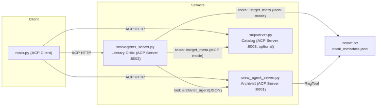
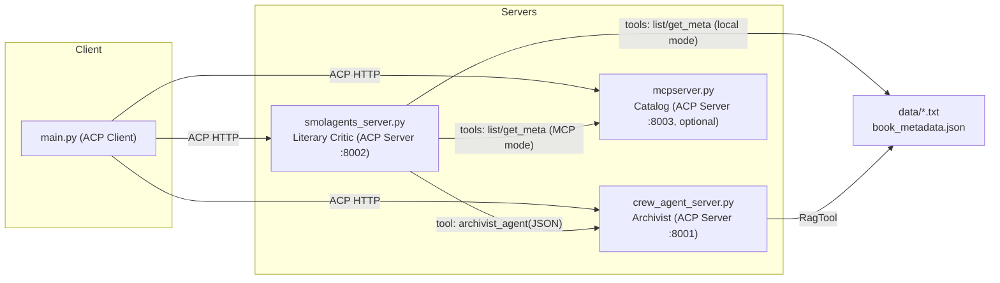
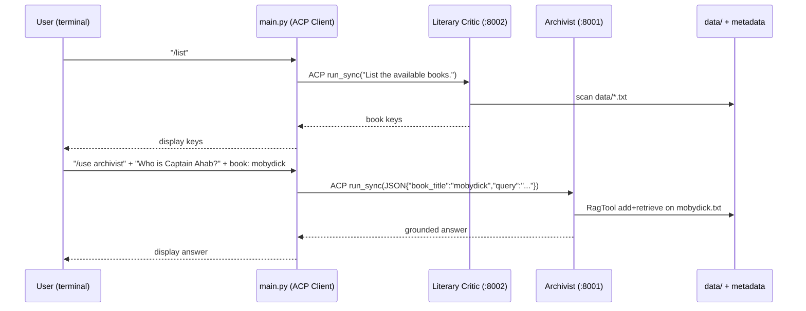
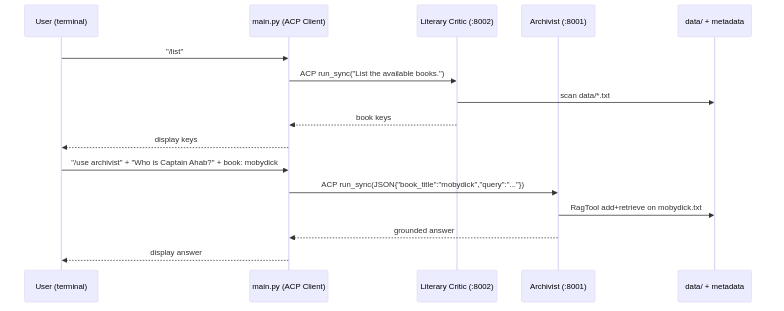

# AI Librarian

A multi-agent system for analyzing books using a tool-calling orchestrator (Smolagents) with a factual RAG archivist (CrewAI).

## An ACP showcase for multi-framework agents

This project demonstrates how to use the ACP protocol to orchestrate agents implemented in different frameworks, all talking over a common, framework-agnostic runtime.

In concrete terms:

- **Smolagents** powers the orchestrator agent (`literary_critic_agent`).
- **CrewAI** powers the specialist RAG agent (`archivist_agent`).
- Both agents are exposed via **ACP servers** and are invoked by an **ACP client** in `main.py`.

This cleanly separates concerns: any ACP-capable client can call either agent, and you can swap or extend agents without coupling to framework-specific SDKs.

## What it does

- **List library contents** by scanning `ai_librarian/data/` for all `*.txt` files.
- **Answer factual questions** about a specific book using a RAG pipeline.
- **Provide historical/critical context** via a web-capable historian agent.

## Project layout

- `ai_librarian/smolagents_server.py` — Orchestrator ("literary_critic_agent") on port `8002`.
- `ai_librarian/crew_agent_server.py` — Archivist agent (CrewAI + RagTool) on port `8001`.
- `ai_librarian/mcpserver.py` — Optional MCP catalog server on port `8003`.
- `ai_librarian/main.py` — CLI client that chats with the critic agent.
- `ai_librarian/data/` — Plain-text books. Filenames define the book keys (e.g., `mobydick.txt` -> `mobydick`).
- `ai_librarian/book_metadata.json` — Optional metadata for books (title, author, year, etc.).

## Requirements

Python 3.11+ and environment variables for your LLM provider (e.g., OpenAI) set so `smolagents` and `crewai` can authenticate.

We use `uv` for dependency management and running apps.

## Quickstart (Makefile)

From `ai_librarian/` you can use:

```bash
make install         # uv sync
make start-archivist # port 8001
make start-critic    # port 8002
make start-catalog   # optional, port 8003
make client          # run interactive ACP CLI
make list            # one-off: ask critic to list books
make kill-ports      # free 8001/8002/8003 if stuck
# one-shot runners
make start-all       # tmux: archivist + critic
make start-all-mcp   # tmux: archivist + catalog + critic (MCP-backed discovery)
```

Diagrams:



## Install deps (with uv)

```bash
uv sync
```

## Step-by-step: Run the services

In three terminals (or panes):

1. Archivist (CrewAI, port 8001)

```bash
python ai_librarian/crew_agent_server.py
```

2. Critic Orchestrator (Smolagents, port 8002)

```bash
python ai_librarian/smolagents_server.py
```

3. (Optional) MCP catalog (port 8003)

```bash
python ai_librarian/mcpserver.py
```

### MCP-backed discovery (ACP between services)

You can have the Critic use the Catalog over ACP (instead of scanning the filesystem directly). This mirrors the @my_acp_project pattern.

Options for the Catalog data source:

- Local JSON (default): `ai_librarian/book_metadata.json`
- Remote JSON: set `BOOK_METADATA_URL` to a GitHub raw URL

Run all with tmux:

```bash
make start-all-mcp
# or manually in 3 terminals:
uv run python ai_librarian/crew_agent_server.py
uv run python ai_librarian/mcpserver.py              # optionally with BOOK_METADATA_URL=...
USE_MCP_DISCOVERY=1 uv run python ai_librarian/smolagents_server.py
```

When `USE_MCP_DISCOVERY=1` is set for the Critic, its tools `list_available_books()` and `get_book_metadata()` call the Catalog over ACP at :8003. If the Catalog is down, it falls back to local scanning/JSON.

## Step-by-step: Use the CLI client (ACP)

```bash
python ai_librarian/main.py
```

You’ll see an interactive prompt with commands:

Commands:

- `/agents` — list agents exposed via ACP
- `/use <agent>` — switch: `critic` | `archivist` | `catalog`
- `/list` — show available book keys (via `critic` or `catalog`)
- `/help` — show help
- `/exit` — quit

Example session:

```text
/list
/use archivist
Who is Captain Ahab?
mobydick
```

Notes:

- `archivist` expects a JSON string with `book_title` and `query`. The CLI helps build it by prompting you for the `book_title`.
- `critic` accepts natural language (it uses tool-calling to coordinate sub-tools and the archivist).

Notes:

- The critic uses the following tools:
  - `list_available_books()` — scans `ai_librarian/data/` for all `*.txt` (no hardcoding to two books).
  - `get_book_metadata(book_key)` — looks up details in `book_metadata.json`.
  - `archivist_agent(input: str)` — calls CrewAI RAG; input must be JSON like `{"book_title": "mobydick", "query": "Who is Captain Ahab?"}`.
  - `historian_agent_tool(query: str)` — searches the web for broader context.

## Add more books

Drop additional `.txt` files into `ai_librarian/data/`. The critic will automatically see them. Optionally add metadata entries in `book_metadata.json` keyed by the filename (without `.txt`).

## Troubleshooting

- **Ports already in use** — Stop existing servers on 8001/8002 (and 8003 if using MCP) and restart.
- **LLM auth** — Ensure your OpenAI (or configured) credentials are available in env for both Smolagents and CrewAI.
- **DuckDuckGo warning** — Smolagents may warn that `duckduckgo_search` is renamed to `ddgs`; it still works, or you can switch to `ddgs`.
- **Pride & Prejudice key** — The demo now uses the normalized key `prideandprejudice` and file `prideandprejudice.txt`. The CLI also supports friendly aliases like "pride and prejudice".

## Design highlights (good for a GitHub showcase)

- **ACP-first design** — Agents are exposed as ACP servers; the CLI demonstrates clean cross-agent calls via ACP instead of framework SDKs.
- **Multi-framework orchestration** — Smolagents (orchestrator) + CrewAI (RAG specialist) living side-by-side.
- **Runtime discovery** — The critic lists books by scanning the `data/` folder; adding a new `.txt` makes it immediately available.
- **Modular tooling** — Clear tool boundaries: listing, metadata lookup, text-grounded answers, and web context.
- **Developer UX** — Interactive CLI that showcases routing requests to different agents and payload shaping for agent-specific schemas.

## Architecture



Rendered PNG (if generated):


## Sequence: listing and answering



Diagrams:



## Render PNGs locally

Requires Mermaid CLI:

```bash
npm i -g @mermaid-js/mermaid-cli
```

Then from `ai_librarian/`:

```bash
make render-diagrams
```
